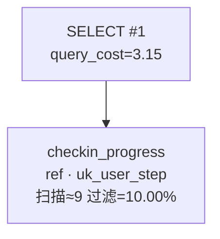

## 执行计划

| 顺序 | 表 | 访问类型 | 使用的索引 | 扫描行数 | 过滤率 | 判读 |
|---:|---|---|---|---:|---:|---|
| 1 | `checkin_progress` | ref | uk_user_step | 9 | 10.00% | — |

```mermaid
flowchart TD
    N1["SELECT #1<br/>query_cost=3.15"]
    N2["checkin_progress<br/>ref · uk_user_step<br/>扫描≈9 过滤=10.00%"]
    N1 --> N2
```
