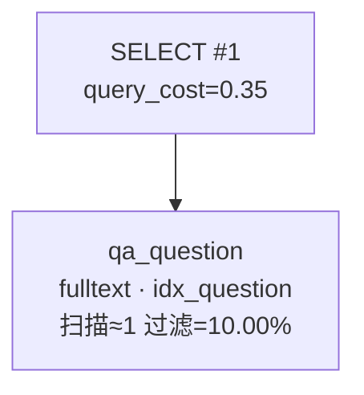

## 执行计划

| 顺序 | 表 | 访问类型 | 使用的索引 | 扫描行数 | 过滤率 | 判读 |
|---:|---|---|---|---:|---:|---|
| 1 | `qa_question` | fulltext | idx_question | 1 | 10.00% | — |

```mermaid
flowchart TD
    N1["SELECT #1<br/>query_cost=0.35"]
    N2["qa_question<br/>fulltext · idx_question<br/>扫描≈1 过滤=10.00%"]
    N1 --> N2
```
