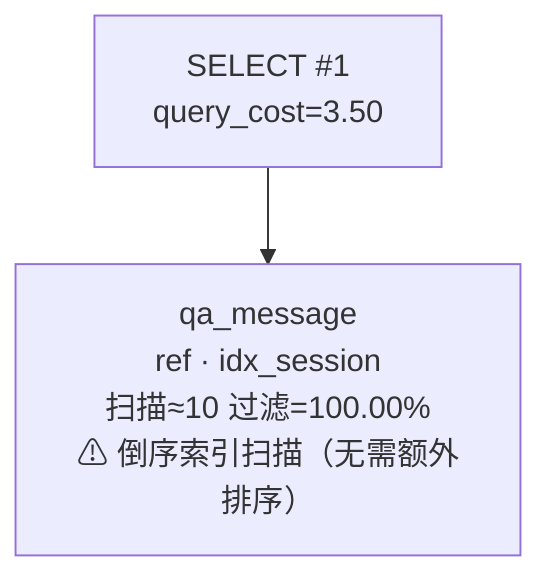

## 执行计划

| 顺序 | 表 | 访问类型 | 使用的索引 | 扫描行数 | 过滤率 | 判读 |
|---:|---|---|---|---:|---:|---|
| 1 | `qa_message` | ref | idx_session | 10 | 100.00% | 倒序索引扫描（无需额外排序） |

```mermaid
flowchart TD
    N1["SELECT #1<br/>query_cost=3.50"]
    N2["qa_message<br/>ref · idx_session<br/>扫描≈10 过滤=100.00%<br/>⚠ 倒序索引扫描（无需额外排序）"]
    N1 --> N2
```
