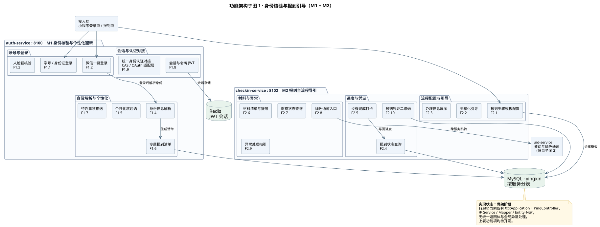
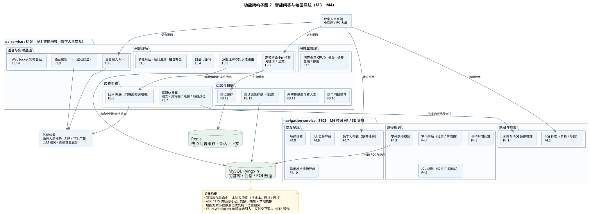
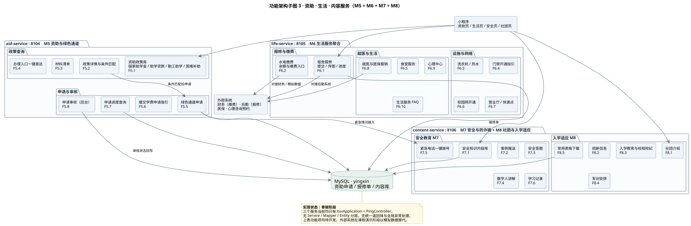
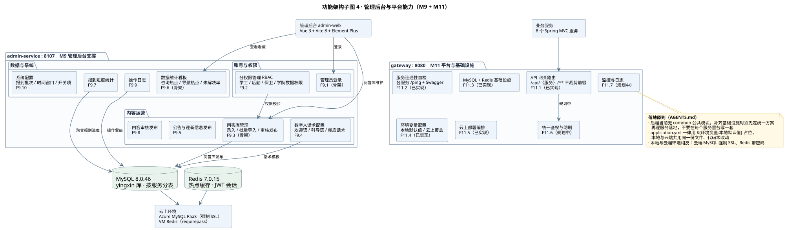

# 需求分析文档


---

## 1 引言

### 1.1 编写目的

本文档对"大学生迎新导引服务数字人系统"的业务需求进行系统化分析，明确系统的功能边界、非功能指标、外部接口与数据要求，作为后续概要设计、详细设计、测试用例编写与项目验收的共同基线。

预期读者：

| 读者 | 关注章节 |
|---|---|
| 项目组开发人员 | 第 4 章功能需求、第 6 章接口需求、第 7 章数据需求 |
| 测试人员 | 第 4 章验收准则、第 5 章非功能需求、第 8 章追踪矩阵 |
| 指导教师 / 评审专家 | 第 2 章总体描述、第 3 章业务分析、第 8 章优先级与追踪 |
| 学校业务方（学工、后勤、保卫） | 第 3 章业务分析、第 4 章对应功能域 |

### 1.2 项目背景

高校新生报到是典型的**短周期、高并发、强流程**场景：数千名新生在 2–3 天内集中到校，需依次完成预报到、缴费、绿色通道、领物资、入住、人脸采集、校园卡激活等环节；而报到政策、办理地点、材料清单等信息分散在官网、公众号、纸质须知、辅导员通知等渠道，新生往往"不知道下一步做什么、去哪做、要带什么"。

传统做法依赖现场志愿者一对一答疑，存在三个结构性问题：

1. **人力瓶颈** —— 咨询集中在少数高峰时段，志愿者数量与咨询量不匹配；
2. **信息不一致** —— 同一问题在不同渠道的答复口径存在差异；
3. **覆盖时长不足** —— 报到前后（尤其夜间与线上预报到阶段）缺乏即时答疑手段。

本项目以**数字人**为统一交互入口，整合迎新政策、报到流程、校园导航、资助与绿色通道、生活服务、安全教育、社团与入学适应等内容，提供 7×24 小时语音 / 文字交互与主动引导，作为线下志愿者的补充而非替代。

### 1.3 术语与缩略语

| 术语 / 缩略语 | 全称或含义 |
|---|---|
| 数字人 | 具备形象、语音、动作的虚拟交互角色，本项目的主要交互入口 |
| 迎新 | 高校新生报到与入学适应阶段的一系列事务 |
| 预报到 | 到校前在线上完成的信息填报与流程预办理 |
| 绿色通道 | 面向家庭经济困难新生的先入学后缴费通道 |
| ASR | Automatic Speech Recognition，语音识别 |
| TTS | Text To Speech，语音合成 |
| LLM | Large Language Model，大语言模型 |
| JWT | JSON Web Token，无状态令牌，本项目用于会话凭证 |
| POI | Point of Interest，地图兴趣点（建筑、报到点、食堂等） |
| RBAC | Role-Based Access Control，基于角色的访问控制 |
| RAG | Retrieval-Augmented Generation，检索增强生成（本项目以问答库增强 LLM 兜底） |
| M 里程碑 | 项目计划中的阶段目标，M1–M7 |
| F x.y | 功能清单中的功能项编号 |
| FR / NFR / IR / DR | 本文档的功能需求 / 非功能需求 / 接口需求 / 数据需求编号 |

### 1.4 参考资料

| 编号 | 名称 | 说明 |
|---|---|---|
| R1 | [需求规格说明书](需求规格说明书.md) v1.0 | 立项阶段需求原始描述 |
| R2 | [功能清单与分解](功能清单.md) v1.0 | 功能项 ID、优先级与实现状态 |
| R3 | [技术难点分析](技术难点分析.md) v1.0 | 难点拆分、降级方案与 Spike 计划 |
| R4 | [项目计划](项目计划.md) | 里程碑、分工与风险登记 |
| R5 | [架构图目录](架构图/) | 本文引用的全部图表（SVG 矢量图） |
| R6 | [AGENTS.md](../AGENTS.md) | 仓库工程约定与实现状态说明 |
| R7 | GB/T 8567-2006 | 计算机软件文档编制规范（章节组织参考） |
| R8 | [数据建模](数据建模.md) | 第 7 章数据需求的字段级展开（数据七要素、36 张表、完整性规则） |
| R9 | [开发规范](开发规范.md) | 横向能力框架、分层与接口/数据/前端契约（实现层约定） |

---

## 2 总体描述

### 2.1 系统目标

| 目标 | 说明 | 衡量方式 |
|---|---|---|
| G1 | 提供 7×24 小时迎新咨询入口 | 新生在任意时段可获得即时答复，无需等待人工 | 可用性监测 + 用户测试 |
| G2 | 打通报到全流程导引 | 新生按步骤完成 7 个报到环节并有明确进度反馈 | 报到完成率统计 |
| G3 | 统一信息口径 | 所有答复源自后台可维护的问答库与内容库 | 后台改库后前端即时生效 |
| G4 | 降低现场答疑压力 | 高频问题由系统承接，人工只处理复杂与异常场景 | 未解答转人工比例 |
| G5 | 形成可复用的服务框架 | 跨服务架构清晰，内容可配置，真实数据可替换 | 数据替换不改代码 |

### 2.2 用户角色与特征

| 编号 | 角色 | 特征与诉求 | 主要使用端 | 权限范围 |
|---|---|---|---|---|
| ACT-1 | 新生 | 系统第一用户；到校前后集中使用；不熟悉校园，问题口语化、碎片化；部分学生经济困难需资助 | 微信小程序 / H5 | 本人身份信息、本人报到进度、公开内容 |
| ACT-2 | 家长 / 访客 | 只读咨询；关心报到安排与安全；不涉及个人隐私数据 | 小程序 / 迎新官网嵌入 | 仅公开内容，不可访问任何个人数据 |
| ACT-3 | 现场志愿者 / 辅导员 | 在迎新现场处理系统未解答问题与异常情况 | PC 大屏 / 管理后台 | 未解答问题队列、学生报到状态 |
| ACT-4 | 学校管理员 | 学工、后勤、保卫、学院等多部门分权维护内容 | 管理后台 | 按 RBAC 划分的数据与功能权限 |
| ACT-5 | 系统运维 | 负责部署、配置、监控与故障处理 | 运维后台 / 命令行 | 系统配置、日志、健康状态 |

### 2.3 运行环境

| 类别 | 本地开发环境 | 云端部署环境 |
|---|---|---|
| 服务运行 | 9 个 Spring Boot 服务运行于宿主机 | 9 个服务容器化编排（`docker-compose.prod.yml`） |
| 数据库 | Docker `mysql:8.0.46`，库 `yingxin` | Azure MySQL PaaS（强制 SSL，`MYSQL_SSL_MODE=REQUIRED`） |
| 缓存 | Docker `redis:7.0.15-alpine`，无密码 | 云主机 systemd 部署 Redis 7.0.15（`requirepass`） |
| 运行时 | JDK 17、Node 18+、Maven Wrapper 3.9.12 | 同左，镜像内置 |
| 客户端 | 微信开发者工具、浏览器 | 微信小程序正式环境、PC 大屏浏览器 |
| 网络 | localhost 直连 | 小程序要求 HTTPS + 已备案域名 |

> 本地与云端共用同一份 `application.yml`，仅通过环境变量区分，代码零改动。

### 2.4 设计与实现约束

| 编号 | 约束 | 来源 |
|---|---|---|
| C-1 | 后端采用 Maven 多模块微服务，服务前缀 `/api/<服务>/**`，网关转发不裁剪前缀 | AGENTS.md |
| C-2 | 配置一律使用 `${环境变量:本地默认值}` 占位，本地与云端同一份文件 | AGENTS.md |
| C-3 | 两个前端项目相互独立：`miniprogram` 的 Vite 锁死 5.2.8，`admin-web` 用 Vite 8，不得统一升级 | AGENTS.md |
| C-4 | 公共基础设施（统一返回体、全局异常、参数校验、JWT 鉴权）须先定统一方案再逐服务落地，不得各服务自建 | AGENTS.md |
| C-5 | 微信人脸核身等接口需企业主体资质，课程阶段降级为模拟核验 | 技术难点 D5-b |
| C-6 | 学校真实数据（地图、报到流程、身份源）不可获得，全部走可配置的虚构数据 | 技术难点 D4-a / D8 |
| C-7 | 校内服务器与开发机资源有限，9 个服务约需 3.8G 内存，按需启动 | AGENTS.md |

### 2.5 假设与依赖

| 编号 | 假设 / 依赖 | 不成立时的影响 |
|---|---|---|
| A-1 | 新生拥有微信账号并能访问小程序 | 需补充 H5 独立入口 |
| A-2 | 学校可提供统一身份认证接口（CAS/OAuth） | 降级为本地模拟账号（D5-a） |
| A-3 | 可获得微信同声传译插件或云厂商 ASR/TTS 服务 | 语音降级为文字输入为主链路（D3-d） |
| A-4 | 地图 SDK（腾讯位置服务）在小程序端能力满足需求 | 降级为静态楼层图 + 文字指引（D4-c） |
| A-5 | LLM 服务可稳定访问且成本可控 | 关闭 LLM，纯问答库 + 兜底话术（D2-d） |

---

## 3 业务与需求分析

### 3.1 业务现状与痛点

| 编号 | 痛点 | 表现 | 对应解决方向 |
|---|---|---|---|
| P1 | 流程认知缺失 | 新生不清楚报到共几步、当前处于哪一步、下一步做什么 | 报到全流程导引（FR-2） |
| P2 | 信息查找成本高 | 政策分散在官网、公众号、纸质材料，检索效率低 | 智能问答统一入口（FR-3） |
| P3 | 空间认知缺失 | 不认路，找不到报到点、宿舍、食堂、医务室 | 校园导航与数字人带路（FR-4） |
| P4 | 经济困难学生顾虑 | 不清楚资助政策与绿色通道办理方式，羞于当面询问 | 资助与绿色通道（FR-5），支持匿名自助查询 |
| P5 | 生活事务无处问 | 报修、缴费、校园网、就医等缺少统一入口 | 生活服务聚合（FR-6） |
| P6 | 诈骗风险 | 新生是电信诈骗高发人群，缺少及时提醒手段 | 安全与防诈骗教育（FR-7） |
| P7 | 内容维护依赖开发 | 政策变化即需重新发版 | 后台可配置 + 改库即时生效（FR-9） |

### 3.2 干系人分析

| 干系人 | 利益诉求 | 影响程度 | 参与方式 |
|---|---|---|---|
| 新生 | 快速、准确、方便地完成报到 | 高 | 需求调研、可用性测试 |
| 学工处 | 提高报到效率、降低现场压力、掌握报到进度 | 高 | 内容提供、验收 |
| 后勤 / 保卫 / 校医院 | 服务信息准确传达 | 中 | 内容提供、分权维护 |
| 各学院 | 本院报到点与流程信息准确 | 中 | 内容维护 |
| 辅导员 / 志愿者 | 减少重复答疑，聚焦异常处理 | 中 | 需求调研、试用反馈 |
| 信息中心 | 系统可维护、数据安全合规 | 中 | 接口对接、安全审查 |
| 项目组 | 按期交付可演示成果 | 高 | 开发与自测 |

### 3.3 业务流程分析

**报到主流程（目标态）**：

```text
身份核验登录
  → 解析身份（本科/研究生、学院专业、宿舍楼栋、报到批次）
  → 生成个性化欢迎语与专属报到清单
  → 线上预报到（信息填报）
  → 缴费（或绿色通道 / 缓交申请）
  → 到校领物资
  → 宿舍入住
  → 人脸采集
  → 校园卡激活
  → 报到完成（可查凭证二维码）
```

**异常分支**：

| 异常场景 | 处理路径 |
|---|---|
| 未缴费 | 引导至缴费入口，或跳转绿色通道 / 缓交申请 |
| 材料缺失 | 展示材料清单与补交办理地点、联系人电话 |
| 暂缓报到 / 改期 | 展示申请流程与审批人联系方式 |
| 问答未命中 | 落库未解答记录，转人工（志愿者 / 辅导员） |
| 身份信息缺失字段 | 隐藏对应模块并提示到现场核实 |

### 3.4 系统用例分析

系统共识别 5 个参与者与 15 个用例，用例与功能项一一对应。


*图 3-1 系统用例图（文件：`架构图/03-系统用例图.svg`，对应附录 A FIG-03）*

图中 5 个参与者（ACT-1–ACT-5）与 15 个用例的对应关系如下：新生（第一用户）覆盖 10 个用例——身份核验与登录、个性化信息与专属报到清单、报到步骤引导与进度打卡、材料与缴费异常处理、智能问答咨询、校园 AR/3D 导航、资助政策查询与绿色通道申请、生活服务办理、安全学习与紧急电话拨号、社团与入学适应（其中「报到引导」在图中拆为 F2.1–F2.5 与 F2.6–F2.9 两个用例）；家长 / 访客复用其中的智能问答咨询、校园 AR/3D 导航与安全学习三个用例（只读）；志愿者 / 辅导员承担未解答问题转人工处理；学校管理员承担内容与话术管理、数据统计看板与分权限管理；系统运维承担系统配置与运维。每个用例均标注功能项编号（F x.y），与 [功能清单](功能清单.md) 一一对应；数字人形象与多端适配（FR-10，里程碑 M10）属跨服务能力，不单列为用例，体现在各端交互中。
**用例关系说明**：

| 关系 | 用例对 | 含义 |
|---|---|---|
| include | 个性化信息与报到清单 → 身份核验与登录 | 必须先完成身份核验才能生成清单 |
| include | 报到步骤引导与打卡 → 身份核验与登录 | 进度与身份绑定 |
| include | 资助政策查询与绿色通道申请 → 身份核验与登录 | 申请需实名 |
| include | 生活服务办理 → 身份核验与登录 | 报修、缴费需实名 |
| include | 内容与话术管理 → 分权限管理 | 管理动作受 RBAC 约束 |
| include | 数据统计看板 → 分权限管理 | 统计范围按角色限定 |
| extend | 智能问答咨询 → 校园 AR/3D 导航 | 问答中涉及地点时延伸出导航 |

---

## 4 功能需求

### 4.1 功能结构总览

系统按 11 个功能域组织，与后端 9 个服务及两个前端对应：

| 功能域 | 名称 | 承载服务 | 功能项数 | 优先级 |
|---|---|---|---|---|
| FR-1 | 身份核验与个性化迎新 | auth-service : 8100 | 9 | P0 |
| FR-2 | 报到全流程导引 | checkin-service : 8102 | 10 | P0 |
| FR-3 | 智能问答（数字人主交互） | qa-service : 8101 | 14 | P0 |
| FR-4 | 校园 AR/3D 导航 | navigation-service : 8103 | 10 | P0 |
| FR-5 | 资助与绿色通道 | aid-service : 8104 | 8 | P1 |
| FR-6 | 生活服务聚合 | life-service : 8105 | 10 | P1 |
| FR-7 | 安全与防诈骗教育 | content-service : 8106 | 6 | P1 |
| FR-8 | 社团与入学适应 | content-service : 8106 | 5 | P1 |
| FR-9 | 管理后台 | admin-service : 8107 + admin-web | 10 | P0 |
| FR-10 | 数字人形象与多端适配 | 跨服务 | 8 | P0 |
| FR-11 | 平台与基础设施 | gateway : 8080 + 基建 | 7 | P0 |


*图 4-1 后端核心服务功能架构图（对应附录 A FIG-02）*

上图为 11 个功能域在 9 个后端服务上的总体分布，是本章的结构总图。为便于逐项核对需求，本章在对应小节末尾进一步给出四张**功能架构子图**，细化到功能项（F x.y）级，并标注外部依赖、关键约束与当前实现状态：

| 子图 | 图片文件 | 覆盖功能域 | 承载服务 | 本文位置 |
|---|---|---|---|---|
| 子图 1 | `06-功能架构子图-身份核验与报到引导.svg` | FR-1、FR-2 | auth-service、checkin-service | §4.3 末（图 4-2） |
| 子图 2 | `07-功能架构子图-智能问答与校园导航.svg` | FR-3、FR-4 | qa-service、navigation-service | §4.5 末（图 4-4） |
| 子图 3 | `08-功能架构子图-资助生活与内容服务.svg` | FR-5–FR-8 | aid-service、life-service、content-service | §4.9 末（图 4-5） |
| 子图 4 | `09-功能架构子图-管理后台与平台能力.svg` | FR-9、FR-11 | admin-service、gateway | §4.12 末（图 4-7） |

> 子图按业务域就近聚合，与总图同源；图中功能项编号与 [功能清单](功能清单.md) 保持一致，实现状态以该清单的状态列为准。
### 4.2 FR-1 身份核验与个性化迎新

| 编号 | 功能需求 | 输入 | 处理逻辑 | 输出 | 优先级 | 验收准则 |
|---|---|---|---|---|---|---|
| FR-1.1 | 学号 / 身份证登录 | 账号、密码 | 校验凭证，对接学校身份源（未接入时用模拟账号） | 登录结果、用户标识 | P0 | 正确凭证登录成功；错误凭证给出明确提示且不泄露账号是否存在 |
| FR-1.2 | 微信一键登录 | 微信 `code` | `code2session` 换 `openid`，查询绑定关系，未绑定时创建并绑定 | JWT 令牌、用户信息 | P0 | 首次登录自动建号并绑定；二次登录直接进入 |
| FR-1.3 | 人脸轻核验 | 人脸图像 / 活体检测结果 | 调用核验服务；课程阶段降级为模拟核验 | 核验通过 / 不通过 | P1 | UI 流程完整；降级时逻辑直接通过并记录降级标记 |
| FR-1.4 | 身份信息解析 | 身份源数据 | 解析培养层次、学院专业、宿舍楼栋、报到批次 | 结构化身份档案 | P0 | 缺失字段不报错，隐藏对应模块 |
| FR-1.5 | 个性化欢迎语 | 身份档案 | 按身份套用欢迎语模板 | 欢迎语文案 | P1 | 不同学院 / 批次可配置不同文案 |
| FR-1.6 | 专属报到清单 | 身份档案、步骤模板 | 按适用人群过滤步骤生成待办清单 | 待办清单 | P0 | 清单项与身份匹配；步骤变更后重新生成 |
| FR-1.7 | 待办事项推送 | 待办清单 | 站内信 / 公众号模板消息推送 | 推送记录 | P1 | 推送失败可重试并记录 |
| FR-1.8 | 会话与令牌 | 用户凭证 | 签发 JWT、写入 Redis、网关校验、续期与登出 | 令牌、会话状态 | P0 | 令牌过期返回 401；登出后令牌立即失效 |
| FR-1.9 | 统一身份认证对接 | CAS / OAuth 响应 | 适配层转换学校认证协议 | 统一用户标识 | P1 | 适配层可替换实现而不改动业务代码 |

### 4.3 FR-2 报到全流程导引

| 编号 | 功能需求 | 输入 | 处理逻辑 | 输出 | 优先级 | 验收准则 |
|---|---|---|---|---|---|---|
| FR-2.1 | 报到步骤模板配置 | 后台配置 | 定义步骤、顺序、适用人群 | 步骤模板 | P0 | 后台调整步骤后前端即时生效，无需发版 |
| FR-2.2 | 步骤化引导 | 身份、当前步骤 | 按模板驱动展示当前步骤与后续步骤 | 引导页面 | P0 | 7 个标准环节可完整走通 |
| FR-2.3 | 办理信息展示 | 步骤定义 | 展示办理地点、办公时间、联系人电话 | 办理信息 | P0 | 信息来自配置而非硬编码 |
| FR-2.4 | 报到状态查询 | 用户标识 | 聚合已完成 / 待完成，计算进度百分比 | 进度总览 | P0 | 进度与打卡记录一致 |
| FR-2.5 | 步骤完成打卡 | 用户确认 / 扫码结果 | 写回进度记录 | 打卡结果 | P0 | 重复打卡幂等，不产生重复记录 |
| FR-2.6 | 材料清单与提醒 | 步骤定义 | 按步骤推送所需材料 | 材料清单 | P1 | 录取通知书、档案、党团关系、照片、户口迁移均覆盖 |
| FR-2.7 | 缴费状态查询 | 用户标识 | 查询财务接口或模拟数据 | 欠费 / 已缴状态 | P1 | 对接失败时展示"暂不可用"而非错误码 |
| FR-2.8 | 绿色通道入口 | 用户标识 | 从报到流跳转资助模块 | 跳转结果 | P1 | 跳转后保留报到上下文，可返回 |
| FR-2.9 | 异常处理指引 | 异常类型 | 展示对应办理指引 | 指引内容 | P1 | 未缴费、材料缺失、暂缓报到、改期四类均覆盖 |
| FR-2.10 | 报到凭证二维码 | 用户标识 | 生成个人报到二维码 | 二维码 | P1 | 扫码可核销，二维码不可伪造 |

**功能架构子图 1：身份核验与报到引导（FR-1、FR-2）**



*图 4-2 功能架构子图 1 · 身份核验与报到引导（对应附录 A FIG-06）*

该子图对应里程碑 M1 + M2，把上两节的 19 个功能项归入两个服务的三组能力：

- **auth-service（: 8100，FR-1，9 项）**
  - 账号与登录：学号 / 身份证登录（F1.1）、微信一键登录（F1.2）、人脸轻核验（F1.3）
  - 身份解析与个性化：身份信息解析（F1.4）、个性化欢迎语（F1.5）、专属报到清单（F1.6）、待办事项推送（F1.7）
  - 会话与认证对接：会话与令牌 JWT（F1.8）、统一身份认证对接（F1.9）
- **checkin-service（: 8102，FR-2，10 项）**
  - 流程配置与引导：报到步骤模板配置（F2.1）、步骤化引导（F2.2）、办理信息展示（F2.3）
  - 进度与凭证：报到状态查询（F2.4）、步骤完成打卡（F2.5）、报到凭证二维码（F2.10）
  - 材料与异常：材料清单与提醒（F2.6）、缴费状态查询（F2.7）、绿色通道入口（F2.8）、异常处理指引（F2.9）

图中连线体现三条关键依赖：**登录后解析身份 → 生成专属报到清单**（F1.4 → F1.6）、**会话存储**（F1.8 的 JWT 写入 Redis，供网关统一校验）、**写回进度**（F2.4 / F2.5 依赖步骤模板 F2.1 的定义）。FR-2.8 绿色通道入口由 checkin-service 跨服务跳转 aid-service（见子图 3），跳转须保留报到上下文且可返回。两个服务当前均为骨架阶段（仅有 `XxxApplication` + `PingController`），图内功能项均待开发。

### 4.4 FR-3 智能问答（数字人主交互）

| 编号 | 功能需求 | 输入 | 处理逻辑 | 输出 | 优先级 | 验收准则 |
|---|---|---|---|---|---|---|
| FR-3.1 | 问答库管理 | 问答条目 | 条目 CRUD、分类、标签、启用 / 停用 | 问答库数据 | P0 | 后台可批量导入；停用条目不被命中 |
| FR-3.2 | 高频问命中的检索 | 问题文本 | 关键词 + 全文检索，优先命中问答库 | 候选答案与置信度 | P0 | 命中时响应 < 1s |
| FR-3.3 | 意图理解 | 问题文本 | 分类意图识别，路由至对应知识域 | 意图标签 | P0 | 口语化提问（如"在哪领被子"）可正确路由 |
| FR-3.4 | 口语化提问 | 自然语言 | 同义词 / 别名映射后进入检索 | 规范化查询 | P0 | TOP 50 高频口语表达全覆盖 |
| FR-3.5 | 多轮对话 | 会话上下文 | 上下文管理、追问、澄清、槽位补全 | 多轮应答 | P1 | 支持至少 3 轮上下文延续 |
| FR-3.6 | LLM 兜底 | 未命中问题 | 携带问答库知识增强的提示词调用 LLM | 生成答案 | P2 | 超时（建议 3s）返回兜底话术，不阻塞会话 |
| FR-3.7 | 富媒体答案 | 答案定义 | 按 block 类型渲染文字 / 图片 / 流程图 / 视频 / 地图点位 | 富媒体答案 | P1 | 各类 block 在前端均可正确渲染 |
| FR-3.8 | 语音输入（ASR） | 音频流 | 转文本后进入问答链路 | 识别文本 | P1 | 安静环境识别可用；嘈杂环境提示改用文字 |
| FR-3.9 | 语音播报（TTS） | 答案文本 | 合成语音并驱动数字人口型 | 音频 | P1 | 音频可正常播放，口型与语音基本同步 |
| FR-3.10 | 热门问题推荐 | 访问统计 | 统计高频问题并展示快捷入口 | 推荐列表 | P1 | 列表随使用数据动态变化 |
| FR-3.11 | 未解答记录与转人工 | 低置信度问题 | 落库未解答记录，供后台分析 / 转辅导员 | 记录、转人工入口 | P1 | 记录可被志愿者 / 辅导员查询与处理 |
| FR-3.12 | 热点缓存 | 问题文本 | Redis 缓存热点问答 | 缓存命中答案 | P0 | 缓存命中响应约 10ms；改库后主动失效 |
| FR-3.13 | 对话记录存储 | 会话消息 | 会话与消息持久化，加密存储 | 会话数据 | P1 | 敏感内容加密存储，明文不落库 |
| FR-3.14 | WebSocket 实时会话 | 长连接 | 数字人实时交互通道 | 实时消息 | P1 | 握手阶段完成鉴权；断线可重连 |

**问答应答链路（三段式）**：


*图 4-3 时序图 · 智能问答（对应附录 A FIG-05）*

链路为「Redis 热点缓存 → 问答库检索 → LLM 兜底」三段式，逐级降级以控成本：缓存命中（F3.12）直接返回约 10ms；未命中则做关键词 + 全文检索（F3.2），命中结果回写缓存；仍不命中才带问答库知识增强的提示词调用 LLM（F3.6），超时（约 3s）返回兜底话术而不阻塞会话；置信度仍低于阈值时落库未解答记录并提示转人工（F3.11）。语音提问经 ASR（F3.8）进入同一链路，答案经 TTS（F3.9）合成并驱动数字人口型（F10.3）。F3.14 的 WebSocket 实时通道尚未引入依赖，现阶段以 HTTP 轮询替代。

### 4.5 FR-4 校园 AR/3D 导航

| 编号 | 功能需求 | 输入 | 处理逻辑 | 输出 | 优先级 | 验收准则 |
|---|---|---|---|---|---|---|
| FR-4.1 | 地图与 POI 数据管理 | 后台配置 | 维护校园底图、建筑、点位数据 | POI 数据 | P0 | 虚构校园数据可完整替换为真实数据且不改代码 |
| FR-4.2 | POI 检索 | 名称 / 类别 | 按关键词或类别检索点位 | POI 列表 | P0 | 支持别名检索（如"医务室 / 校医院"） |
| FR-4.3 | 室外路径规划 | 起点、终点 | 图算法（节点 + 边 + 权重）计算最短路 | 路径与折线 | P0 | 校门→报到点→宿舍→食堂→超市→医务室→图书馆 可规划 |
| FR-4.4 | 室内导航 | 楼栋、目标房间 | 楼层图与静态指引 | 楼层指引 | P1 | 无室内定位时以静态指引呈现，不声称实时定位 |
| FR-4.5 | 步行时间估算 | 路径长度 | 按步速估算耗时 | 距离与耗时 | P0 | 估算值与实际步行差异可接受 |
| FR-4.6 | 校内通勤 | 起终点 | 公交 / 通勤车线路与站点 | 线路方案 | P2 | 线路数据可配置 |
| FR-4.7 | 数字人带路 | 路径 | 路径节点转自然语言并由数字人播报 | 语音指引 | P1 | 播报内容与路径一致，距离取整 |
| FR-4.8 | 地标讲解 | POI | 展示建筑介绍、开放时间、楼层分布 | 讲解内容 | P1 | 内容来自配置 |
| FR-4.9 | AR 实景导航 | 摄像头画面 | 实景叠加指引 | AR 画面 | P2 | 明确为加分项，可整体不实现 |
| FR-4.10 | 常用地点快捷导航 | — | 报到点、宿舍、食堂一键直达 | 导航结果 | P1 | 快捷入口可配置 |

**功能架构子图 2：智能问答与校园导航（FR-3、FR-4）**



*图 4-4 功能架构子图 2 · 智能问答与校园导航（对应附录 A FIG-07）*

该子图对应里程碑 M3 + M4，两个服务共 24 个功能项：

- **qa-service（: 8101，FR-3，14 项）**：问答库管理（F3.1）、问题理解（F3.2–F3.5）、应答生成与记录（F3.6、F3.7、F3.13）、语音与实时通道（F3.8、F3.9、F3.14）、运营与数据（F3.10–F3.12）
- **navigation-service（: 8103，FR-4，10 项）**：地图与检索（F4.1、F4.2）、路径规划（F4.3–F4.6）、交互呈现（F4.7–F4.10）

子图同时集中列出本功能域的关键约束与外部依赖，作为后续选型与降级决策的依据（降级方案详见 [技术难点分析](技术难点分析.md)）：

| 关键约束 | 对应需求 | 降级方向 |
|---|---|---|
| 问答库优先命中，LLM 仅兜底以控成本 | FR-3.2、FR-3.6 | 关闭 LLM，返回兜底话术（D2-d） |
| ASR / TTS 供应商待定，先接口抽象 + 本地模拟 | FR-3.8、FR-3.9 | 语音降级为文字输入（D3-d） |
| 地图方案在小程序生态优先选腾讯位置服务 | FR-4.1–FR-4.7 | 静态楼层图 + 文字指引（D4-c） |
| WebSocket 依赖尚未引入，实时交互暂以 HTTP 替代 | FR-3.14 | HTTP 轮询 / 长轮询 |

问答与导航之间通过「答案内嵌地图点位」衔接：问答命中涉及地点时延伸出导航（对应用例图中的 «extend» 关系），导航侧读取 POI 与路网数据完成路径规划并交由数字人播报。

### 4.6 FR-5 资助与绿色通道

| 编号 | 功能需求 | 输入 | 处理逻辑 | 输出 | 优先级 | 验收准则 |
|---|---|---|---|---|---|---|
| FR-5.1 | 资助政策库 | 后台配置 | 维护国家助学金、助学贷款、勤工助学、困难补助等政策 | 政策列表 | P1 | 政策可分类检索 |
| FR-5.2 | 政策详情与条件匹配 | 身份档案 | 按身份匹配可申请项目 | 匹配结果 | P1 | 不匹配项目明确说明原因 |
| FR-5.3 | 材料清单 | 资助项目 | 展示各项所需材料明细 | 材料清单 | P1 | 可下载 / 保存 |
| FR-5.4 | 办理入口一键直达 | 资助项目 | 展示咨询电话、办理地点、在线入口 | 入口信息 | P1 | 电话可一键拨打，地点可跳转导航 |
| FR-5.5 | 绿色通道申请 | 申请表单、材料 | 线上提交申请与材料 | 申请单 | P1 | 必填项校验；提交后状态可查 |
| FR-5.6 | 缓交学费申请指引 | 政策数据 | 展示条件、流程、所需材料 | 指引内容 | P1 | 内容可后台维护 |
| FR-5.7 | 申请进度查询 | 用户标识 | 查询本人申请审核状态 | 进度状态 | P1 | 状态变更及时反映 |
| FR-5.8 | 申请审核 | 管理员操作 | 后台审核、驳回理由、通过归档 | 审核结果 | P1 | 驳回必须填写理由；操作留痕 |

### 4.7 FR-6 生活服务聚合

| 编号 | 功能需求 | 输入 | 处理逻辑 | 输出 | 优先级 | 验收准则 |
|---|---|---|---|---|---|---|
| FR-6.1 | 宿舍报修 | 报修单、照片 | 提交报修单并支持进度查询 | 报修单、进度 | P1 | 照片可上传；进度可查 |
| FR-6.2 | 水电缴费 | 用户标识 | 余额查询与缴费入口（对接或模拟） | 余额、缴费结果 | P1 | 对接失败时给出明确提示 |
| FR-6.3 | 洗衣机 / 热水 | 位置 | 使用方法、点位、状态查询 | 使用指引 | P2 | 信息可配置 |
| FR-6.4 | 门禁 | 用户标识 | 门禁开通指引与状态 | 指引、状态 | P2 | 指引内容可配置 |
| FR-6.5 | 食堂服务 | 位置 | 菜单、营业时间、优惠信息 | 食堂信息 | P1 | 信息可后台维护 |
| FR-6.6 | 校园网开通 | 用户标识 | 办理流程、套餐、报障 | 办理指引 | P1 | 覆盖办理与报障两条路径 |
| FR-6.7 | 营业厅 / 快递点 | — | 位置与营业时间 | 点位信息 | P2 | 可跳转导航 |
| FR-6.8 | 就医与医保 | — | 就医流程、医保报销指引 | 指引内容 | P1 | 覆盖校医院与校外就医两种情形 |
| FR-6.9 | 心理中心 | — | 介绍、预约入口、热线 | 信息与入口 | P1 | 热线可一键拨打 |
| FR-6.10 | 生活服务 FAQ | — | 聚合常见生活问题入口 | 问答入口 | P1 | 入口指向问答库对应分类 |

### 4.8 FR-7 安全与防诈骗教育

| 编号 | 功能需求 | 输入 | 处理逻辑 | 输出 | 优先级 | 验收准则 |
|---|---|---|---|---|---|---|
| FR-7.1 | 安全知识内容库 | 后台配置 | 维护刷单、网贷、冒充老师、校园贷、行李防盗等内容 | 内容列表 | P1 | 内容分类清晰，来源可标注 |
| FR-7.2 | 案例推送 | 阶段、身份 | 按报到阶段推送"新生必看" | 推送记录 | P1 | 推送时机与内容可配置 |
| FR-7.3 | 安全答题 | 答题结果 | 轻量答题，记录得分 | 得分记录 | P2 | 得分可查 |
| FR-7.4 | 数字人讲解 | 内容条目 | 安全主题由数字人播报 | 播报结果 | P1 | 可切换讲解主题 |
| FR-7.5 | 紧急电话一键拨号 | — | 保卫处、辅导员、校医院、报警 | 拨号动作 | P0 | 号码正确且可一键拨打 |
| FR-7.6 | 学习记录 | 阅读 / 答题行为 | 跟踪已读与已答题状态 | 学习状态 | P2 | 状态可查 |

### 4.9 FR-8 社团与入学适应

| 编号 | 功能需求 | 输入 | 处理逻辑 | 输出 | 优先级 | 验收准则 |
|---|---|---|---|---|---|---|
| FR-8.1 | 社团介绍 | 后台配置 | 社团名录、简介、联系方式 | 社团列表 | P1 | 可按类别筛选 |
| FR-8.2 | 招新信息 | 后台配置 | 招新时间、地点、加入方式 | 招新信息 | P1 | 可跳转导航 |
| FR-8.3 | 入学教育与校规校纪 | 后台配置 | 校规、学籍、考试纪律等 | 内容页面 | P1 | 内容可后台维护 |
| FR-8.4 | 军训安排 | 后台配置 | 时间、地点、着装与注意事项 | 安排信息 | P1 | 按批次展示 |
| FR-8.5 | 常用表格下载 | — | 请假、证明、补办卡等模板 | 文件下载 | P2 | 文件可下载且格式正确 |

**功能架构子图 3：资助 · 生活 · 内容服务（FR-5–FR-8）**



*图 4-5 功能架构子图 3 · 资助 · 生活 · 内容服务（对应附录 A FIG-08）*

该子图对应里程碑 M5–M8，三个服务共 29 个功能项：

- **aid-service（: 8104，FR-5，8 项）**：政策查询（F5.1–F5.4）、申请与审核（F5.5–F5.8）
- **life-service（: 8105，FR-6，10 项）**：报修与缴费（F6.1、F6.2）、设施与网络（F6.3、F6.4、F6.6、F6.7）、就医与生活（F6.5、F6.8–F6.10）
- **content-service（: 8106，FR-7 + FR-8，共 11 项）**：安全教育 M7（F7.1–F7.6）、入学适应 M8（F8.1–F8.5）

图中标注了两条业务闭环与三条外部依赖：

- **闭环一（资助）**：条件匹配后申请 → 材料提交 → 审核状态回写（F5.2 → F5.5 → F5.8 → F5.7），与 §4.6 的「申请审核闭环测试」验证方式对应；
- **闭环二（生活）**：报修单提交与进度查询（F6.1）、缴费余额与入口（F6.2）构成生活事务的线上闭环；
- **紧急情况接入**：安全内容 F7.5 的紧急电话一键拨号直达电话，不经后端链路（对应 NFR-2.2 的降级思路，外部依赖不可用时不阻断主流程）。

外部依赖为财务（缴费）、后勤（报修）与医保、心理咨询预约，课程演示阶段统一以模拟数据替代（对应约束 C-6、假设 A-2，替换真实系统不改代码）。三个服务当前均为骨架阶段，外部系统对接亦为模拟实现。

### 4.10 FR-9 管理后台

| 编号 | 功能需求 | 输入 | 处理逻辑 | 输出 | 优先级 | 验收准则 |
|---|---|---|---|---|---|---|
| FR-9.1 | 管理员登录 | 账号、密码 | 校验凭证并签发令牌，前端路由守卫 | 登录结果 | P0 | 未登录访问受保护路由自动跳转登录 |
| FR-9.2 | 分权限管理（RBAC） | 角色配置 | 学工、后勤、保卫、学院按角色划分数据与功能权限 | 权限判定结果 | P1 | 越权访问被拒绝且有日志 |
| FR-9.3 | 问答库管理 | 问答条目 | 条目录入、批量导入、审核发布 | 问答库数据 | P0 | 发布后前端即时生效 |
| FR-9.4 | 数字人话术配置 | 话术模板 | 欢迎语、引导语、兜底话术模板维护 | 话术配置 | P1 | 模板支持变量占位（如学院名） |
| FR-9.5 | 公告与迎新信息发布 | 公告内容 | 公告 CRUD 与推送 | 公告 | P1 | 可定时发布与撤回 |
| FR-9.6 | 数据统计看板 | 埋点数据 | 咨询热点、导航热点、用户量、问题未解决率 | 看板图表 | P1 | 数据准确可回溯 |
| FR-9.7 | 报到进度统计 | 报到记录 | 各学院 / 批次报到完成率 | 统计报表 | P1 | 可按学院与批次下钻 |
| FR-9.8 | 内容审核发布 | 内容条目 | 安全 / 社团 / 生活内容上下线 | 内容状态 | P1 | 未审核内容不可见于前端 |
| FR-9.9 | 操作日志 | 管理操作 | 记录后台关键操作 | 日志记录 | P2 | 记录操作人、时间、对象、结果 |
| FR-9.10 | 系统配置 | 配置项 | 报到批次、时间窗口、开关项 | 配置数据 | P2 | 开关可即时生效 |

### 4.11 FR-10 数字人形象与多端适配

| 编号 | 功能需求 | 输入 | 处理逻辑 | 输出 | 优先级 | 验收准则 |
|---|---|---|---|---|---|---|
| FR-10.1 | 数字人形象加载 | 形象资源 | 2D（Live2D / 厂商 SDK）优先，3D（Three.js）为加分 | 形象渲染 | P0 | 真机可加载形象 |
| FR-10.2 | 实时流 / WebRTC | 音视频流 | 前端渲染或云端推流 | 音视频通道 | P1 | 延迟可接受；弱网可降级 |
| FR-10.3 | 口型与动作同步 | TTS 音频 | 依据音频驱动口型 | 口型动画 | P1 | 口型与语音基本同步 |
| FR-10.4 | 微信小程序端 | — | 主入口，登录 + 全功能 | 小程序应用 | P0 | 真机可完成主流程 |
| FR-10.5 | H5 / 公众号 | — | 模板消息与 H5 页面 | H5 应用 | P1 | 与小程序体验一致 |
| FR-10.6 | 迎新官网嵌入 | — | iframe / SDK 嵌入咨询入口 | 嵌入页面 | P2 | 嵌入后不影响官网性能 |
| FR-10.7 | PC 现场大屏咨询台 | — | 迎新现场数字人自助咨询 | 大屏应用 | P2 | 支持语音 + 触控 |
| FR-10.8 | 多端一致体验 | — | 统一主题、组件与请求封装 | 统一前端体验 | P1 | 各端视觉与交互一致 |

**形象方案与降级路径**（详见 [技术难点分析](技术难点分析.md) D1）：

| 完整形态 | 降级形态 | 触发条件 |
|---|---|---|
| 3D 实时交互 + 口型同步 | 2D 形象 + 文字气泡 + 预录语音 | 3D 渲染管线在真机不达标 |
| 云端推流 | 仅前端渲染 | GPU 实例成本或运维受限 |
| 语音为主入口 | 文字输入为主、语音为辅 | ASR 在嘈杂迎新现场识别率骤降 |
| 口型逐帧同步 | 三态动画（待机 / 播报 / 加载） | 音素级时间戳对齐成本过高 |

### 4.12 FR-11 平台与基础设施

| 编号 | 功能需求 | 说明 | 优先级 | 当前状态 |
|---|---|---|---|---|
| FR-11.1 | API 网关路由 | 按 `/api/〈服务〉/**` 转发，不裁剪前缀 | P0 | 已实现 |
| FR-11.2 | 服务连通性自检 | 8 个业务服务 `/ping` + Swagger 文档（gateway 无自检接口） | P0 | 已实现 |
| FR-11.3 | MySQL + Redis 基础设施 | 本地 Docker，云端 Azure MySQL + VM Redis | P0 | 已实现 |
| FR-11.4 | 环境变量配置 | 本地默认值 / 云上覆盖，代码零改动 | P0 | 已实现 |
| FR-11.5 | 云上部署编排 | `docker-compose.prod.yml` + 部署指南 | P1 | 已实现 |
| FR-11.6 | 鉴权与防刷 | 网关统一鉴权、限流、防爬 | P1 | 待开发 |
| FR-11.7 | 监控与日志 | 健康检查、集中日志、告警 | P2 | 待开发 |

**后端技术架构**：


*图 4-6 后端技术架构图（对应附录 A FIG-01）*

架构自上而下分为四层：**接入层**（微信小程序 / H5、管理后台 admin-web、PC 现场大屏）、**网关层**（gateway : 8080，按 `/api/〈服务〉/**` 转发且不裁剪前缀，CORS 在此全局配置）、**业务服务层**（8 个业务服务，端口 8100–8107）、**数据缓存层**（MySQL `yingxin` 库按服务分表、Redis 承载热点问答缓存与 JWT 会话）。本地与云端共用同一份 `application.yml`，仅以环境变量区分（C-2 / NFR-5.3）；云端 MySQL 强制 SSL、Redis 启用 `requirepass`，本地均无（NFR-6.4 / NFR-6.5）。图下方注释标明了骨架阶段的现状与后续补齐方向。

**管理后台与平台能力子图**：



*图 4-7 功能架构子图 4 · 管理后台与平台能力（对应附录 A FIG-09）*

该子图对应里程碑 M9 + M11，把管理后台（FR-9）与平台基建（FR-11）放在同一视角下，是「内容可配置、数据可替换」（NFR-5.1 / NFR-5.2）的落地载体：

- **admin-service（: 8107，FR-9，10 项）**：账号与权限（F9.1 骨架、F9.2）、内容运营（F9.3 骨架、F9.4、F9.5、F9.8）、数据与系统（F9.6 骨架、F9.7、F9.9、F9.10）
- **gateway + 基础设施（FR-11，7 项）**：F11.1–F11.5 已实现（网关路由、连通性自检、MySQL + Redis、环境变量配置、云上部署编排），F11.6 统一鉴权与防刷、F11.7 监控与日志为规划中

子图同时标出两条必须遵守的落地原则：后端当前**无 common 公共模块**，补齐统一返回体、全局异常处理等基础设施时须先定统一方案再逐服务落地，不得各服务自建（C-4）；配置文件一律使用 `${环境变量:本地默认值}` 占位，本地与云端共用同一份文件、代码零改动（C-2）。图中还标出 admin-service 与 8 个业务服务共享同一套 MySQL / Redis 与云上环境，故基础设施变更须同时兼顾本地与云端两种相反的连接配置。

---

## 5 非功能需求

### 5.1 性能需求

| 编号 | 需求项 | 指标 | 度量方式 |
|---|---|---|---|
| NFR-1.1 | 问答响应时间 | 问答库命中 < 1s；整体链路 < 2s（迎新高峰并发下） | 压测报告 |
| NFR-1.2 | 缓存命中响应 | Redis 缓存命中约 10ms 量级 | 接口耗时监控 |
| NFR-1.3 | LLM 兜底超时 | 超时上限 3s，超时返回兜底话术而非阻塞 | 超时日志统计 |
| NFR-1.4 | 导航路径规划 | 单次规划 < 500ms | 接口耗时监控 |
| NFR-1.5 | 并发承载 | 满足高峰时段同时在线上限（目标值由压测定档） | 压测报告 |
| NFR-1.6 | 数字人流媒体延迟 | 延迟可接受（目标值待方案确定后补充） | 实测 |

### 5.2 可靠性需求

| 编号 | 需求项 | 指标 |
|---|---|---|
| NFR-2.1 | 可用性 | 报到期间 7×24 可用；关键服务支持自动重启 |
| NFR-2.2 | 容错性 | 外部依赖（财务、地图、LLM）不可用时降级提示，不阻断主流程 |
| NFR-2.3 | 数据一致性 | 同库分表规避分布式事务；打卡等写操作幂等 |
| NFR-2.4 | 缓存一致性 | 后台改库主动失效对应缓存 key，避免脏读 |
| NFR-2.5 | 备份恢复 | 数据库定期备份（云端由 PaaS 能力保障） |

### 5.3 易用性需求

| 编号 | 需求项 | 指标 |
|---|---|---|
| NFR-3.1 | 零引导可用 | 新生无需培训即可完成主要咨询 |
| NFR-3.2 | 交互步数 | 从首页到获得任一高频问题答案 ≤ 3 次交互 |
| NFR-3.3 | 口语化容错 | 同义表达、少量错别字不影响意图识别 |
| NFR-3.4 | 无障碍 | 支持语音输入作为文字输入的替代路径 |
| NFR-3.5 | 多端一致 | 小程序 / H5 主题、组件、术语一致 |

### 5.4 安全性需求

| 编号 | 需求项 | 措施 |
|---|---|---|
| NFR-4.1 | 身份鉴别 | JWT 令牌 + 网关统一校验；白名单放行 ping / login |
| NFR-4.2 | 传输安全 | 全链路 HTTPS；小程序强制 HTTPS |
| NFR-4.3 | 存储加密 | 身份证、人脸数据、对话记录加密存储，不落敏感原文 |
| NFR-4.4 | 权限最小化 | 后台按 RBAC 分权；越权访问拒绝并留痕 |
| NFR-4.5 | 防爬防刷 | 网关限流、防重放、验证码（F11.6） |
| NFR-4.6 | 审计追溯 | 后台关键操作留痕，可追溯操作人与时间 |
| NFR-4.7 | 隐私边界 | 家长 / 访客角色不可访问任何个人数据 |

### 5.5 可维护性需求

| 编号 | 需求项 | 措施 |
|---|---|---|
| NFR-5.1 | 内容可配置 | 问答库、话术、步骤模板、POI、公告均后台可配，无需发版 |
| NFR-5.2 | 数据可替换 | 虚构校园数据与真实数据结构一致，替换不改代码 |
| NFR-5.3 | 配置一致性 | 本地与云端同一份配置文件，仅环境变量区分 |
| NFR-5.4 | 接口文档 | 每服务提供 springdoc 文档（`/swagger-ui.html`） |
| NFR-5.5 | 代码规范 | 统一返回体、全局异常处理、参数校验、中文注释 |
| NFR-5.6 | 可测试性 | 关键服务提供单元测试，CI 校验构建 |

### 5.6 兼容性需求

| 编号 | 需求项 | 指标 |
|---|---|---|
| NFR-6.1 | 微信小程序 | 主流微信版本可正常运行 |
| NFR-6.2 | 移动端浏览器 | iOS Safari、Android Chrome 主流版本 |
| NFR-6.3 | PC 端 | Chrome / Edge 主流版本；支持 1920×1080 大屏 |
| NFR-6.4 | 数据库兼容 | MySQL 8.0 兼容；云端启用 SSL 连接 |
| NFR-6.5 | 缓存兼容 | Redis 7.0 兼容；本地无密码、云端启用 requirepass |

---

## 6 接口需求

### 6.1 用户接口

| 编号 | 接口 | 说明 |
|---|---|---|
| IR-1.1 | 微信小程序 | 主交互入口，承载全部新生侧功能 |
| IR-1.2 | H5 / 公众号 | 官网嵌入与模板消息跳转 |
| IR-1.3 | 管理后台（Web） | 管理员内容维护与数据查看 |
| IR-1.4 | PC 现场大屏 | 迎新现场数字人自助咨询 |
| IR-1.5 | 数字人形象层 | 形象渲染、语音播报、状态呈现 |

### 6.2 软件接口（外部系统）

| 编号 | 外部系统 | 交互内容 | 不可用时降级 |
|---|---|---|---|
| IR-2.1 | 学校统一身份认证（CAS/OAuth） | 用户认证、身份信息获取 | 使用本地模拟账号 |
| IR-2.2 | 微信开放平台 | `code2session`、用户信息、模板消息 | 短信 / 站内信替代 |
| IR-2.3 | 微信人脸核身 | 实名核验 | 模拟核验（逻辑直接通过） |
| IR-2.4 | ASR 服务 | 语音转文字 | 仅文字输入 |
| IR-2.5 | TTS 服务 | 文字转语音 | 仅文字气泡 |
| IR-2.6 | LLM 服务 | 兜底答案生成 | 关闭 LLM，返回兜底话术 |
| IR-2.7 | 地图 SDK（腾讯位置服务） | 地图渲染、POI、路径绘制 | 静态楼层图 + 文字指引 |
| IR-2.8 | 财务系统 | 缴费状态查询 | 展示模拟数据并标注 |
| IR-2.9 | 后勤系统 | 报修单流转 | 仅记录并展示受理状态 |

### 6.3 通信接口（内部 API 约定）

| 编号 | 约定项 | 内容 |
|---|---|---|
| IR-3.1 | 路由前缀 | `/api/〈服务简称〉/**`，网关转发不裁剪前缀 |
| IR-3.2 | 接口风格 | RESTful；实时交互规划走 WebSocket |
| IR-3.3 | 统一响应体 | `{ code, message, data }` |
| IR-3.4 | 错误码分段 | 1xxx 认证 / 2xxx 业务 / 9xxx 系统 |
| IR-3.5 | 鉴权头 | `Authorization: Bearer <jwt>`，网关统一校验，白名单放行 ping / login |
| IR-3.6 | 用户上下文透传 | 网关解析 JWT 后写请求头下发，下游服务只读 Header |
| IR-3.7 | 接口文档 | 每服务 springdoc，路径 `/swagger-ui.html` |

**登录与网关鉴权链路**：


*图 6-1 时序图 · 微信一键登录与网关统一鉴权（对应附录 A FIG-04）*

时序覆盖三段：**首次登录**（`wx.login` 取临时 code → 经网关按路径转发至 auth-service → `code2session` 换 openid → 按 openid 查绑定关系，未绑定则新建用户并绑定、解析身份 → 写入 Redis 会话并设置 TTL → 返回 `{ code, message, data }` 与 token，前端同时存 Pinia 与 localStorage 的 `yingxin_token`）；**携带令牌访问**（`Authorization: Bearer <jwt>`，网关校验存在性、有效期与续期策略，有效则注入用户上下文后转发，缺失或失效返回 401，前端清除本地 token 并跳转登录）；**登出**（删除会话，令牌立即失效）。

图中同时标注了 F11.6 统一鉴权的目标态与现状：目标为网关 Filter 统一校验、白名单放行 `ping` / `login`；现状为尚无拦截器或 Filter，前端下发的 Bearer 令牌无人校验，属需优先补齐的基础设施（对应约束 C-4、NFR-4.1）。FR-1.8 的令牌续期策略与 §5.4 的传输安全要求在此链路上一并落地。

---

## 7 数据需求

> 本章是数据需求的**概念层基线**（实体识别、关系、完整性要求、量级、安全要求）。
> **字段级定义**（36 张表 + 2 类 Redis 结构）、命名与类型口径、约束与索引，统一维护在 [数据建模](数据建模.md)，
> 本章与其冲突时以《数据建模》为准。当前 `backend/init-sql/01-init.sql` 仅执行建库，表结构将按
> [开发规范](开发规范.md) §5.3 以 Flyway 迁移脚本落地。
>
> 阅读提示：§7.1 中 **DR-21–DR-33 为本次补充识别的实体**（原因见 §7.1 表后说明）；
> **§8.4 列出了当前属于过量设计、建议裁剪的部分**（含 8 张数据表），优先裁剪再建模。

### 7.1 数据实体识别

数据实体分两类：**表实体**（36 张表，按服务前缀分表）与**缓存结构**（2 类 Redis 结构，不建表）。

| 编号 | 实体 | 归属服务 | 落地表（含拆分） | 对应功能 |
|---|---|---|---|---|
| DR-1 | 用户账号 | auth-service | `auth_user` | F1.1、F1.2、F1.9 |
| DR-2 | 身份档案 | auth-service | `auth_identity` | F1.4–F1.6 |
| DR-3 | 会话令牌 | auth-service | **Redis** `yx:auth:session:*`（不建表） | F1.8 |
| DR-4 | 报到步骤模板 | checkin-service | `checkin_step_template` | F2.1–F2.3 |
| DR-5 | 报到进度记录 | checkin-service | `checkin_progress` | F2.2、F2.4、F2.5 |
| DR-6 | 材料清单项 | checkin-service | `checkin_material_item` | F2.6 |
| DR-7 | 问答条目 | qa-service | `qa_question` | F3.1–F3.4 |
| DR-8 | 会话与消息 | qa-service | `qa_session` + `qa_message`（拆分） | F3.5、F3.7、F3.13 |
| DR-9 | 未解答记录 | qa-service | `qa_unanswered` | F3.11 |
| DR-10 | 热点缓存项 | qa-service | **Redis** `yx:qa:hot:*`（不建表） | F3.12 |
| DR-11 | POI 数据 | navigation-service | `nav_poi` | F4.1、F4.2、F4.8 |
| DR-12 | 路网数据 | navigation-service | `nav_node` + `nav_edge`（拆分） | F4.3、F4.5、F4.6 |
| DR-13 | 资助政策 | aid-service | `aid_policy` | F5.1–F5.4、F5.6 |
| DR-14 | 资助申请 | aid-service | `aid_application` + `aid_application_material`（拆分） | F5.5、F5.7、F5.8 |
| DR-15 | 报修单 | life-service | `life_repair_order` | F6.1、F6.2 |
| DR-16 | 内容条目 | content-service | `content_article` | F7.1–F7.4、F8.2–F8.4 |
| DR-17 | 公告 | admin-service | `admin_announcement` | F9.5 |
| DR-18 | 管理员与角色 | admin-service | `admin_user` + `admin_role` + `admin_user_role` | F9.1、F9.2 |
| DR-19 | 操作日志 | admin-service | `admin_operation_log` | F9.9、NFR-4.6 |
| DR-20 | 系统配置 | admin-service | `admin_config` | F9.10、F2.1 |

**补充识别的实体**（原清单停留在概念层，以下为对照功能清单逐项核对后补齐的空白）：

| 编号 | 实体 | 归属服务 | 落地表 | 补它的原因（对应功能） |
|---|---|---|---|---|
| DR-21 | 待办推送记录 | auth-service | `auth_push_record` | 推送无记录则失败无法重试（F1.7） |
| DR-22 | 登录日志 | auth-service | `auth_login_log` | 登录审计与异常登录排查（F1.8、NFR-4.6） |
| DR-23 | 报到凭证 | checkin-service | `checkin_certificate` | 扫码核销必须有凭证与核销状态（F2.10） |
| DR-24 | 异常处理指引 | checkin-service | `checkin_exception_guide` | 四类异常分支的办理指引需可维护（F2.9） |
| DR-25 | 提问日志 | qa-service | `qa_ask_log` | 数据看板与热门问题**没有数据源**（F9.6、F3.10） |
| DR-26 | 常用地点 | navigation-service | `nav_favorite` | 快捷导航需按用户保存（F4.10） |
| DR-27 | 报修流转记录 | life-service | `life_repair_log` | 报修进度与处理留痕（F6.1） |
| DR-28 | 生活服务信息 | life-service | `life_service_info` | 食堂/校园网/快递/就医/心理中心等信息无承载表（F6.3–F6.10） |
| DR-29 | 社团名录 | content-service | `content_club` | 社团名录是结构化数据，非图文条目（F8.1） |
| DR-30 | 学习记录 | content-service | `content_learning_record` | 已读/答题状态跟踪（F7.3、F7.6） |
| DR-31 | 表格文件 | content-service | `content_file` | 常用表格下载需文件元数据（F8.5） |
| DR-32 | 角色数据范围 | admin-service | `admin_role_scope` | 分权管理的数据范围需可配置（F9.2、F9.7） |
| DR-33 | 埋点事件 | admin-service | `admin_behavior_event` | 数据看板缺少统一的埋点数据源（F9.6、F9.7） |

> 合计 36 张表（含 8 张由 DR-8 / DR-12 / DR-14 拆分产生）+ 2 类缓存结构；
> 其中 §8.4 建议裁剪 8 张、合并 1 张，裁剪后约 27 张。招新信息（F8.2）**不单建表**，
> 复用 `content_article`（增加有效期与关联点位字段）。

### 7.2 数据关系（概念）

```text
用户账号 1 ── 0..1 身份档案            （身份源未提供时整条缺失）
用户账号 1 ── N 报到进度记录 ── N ── 1 报到步骤模板
用户账号 1 ── 0..1 报到凭证            （完成报到后才签发、只签发一次）
用户账号 1 ── N 会话 ── N 消息
问答条目 1 ── N 未解答记录             （低置信度未命中时生成）
用户账号 1 ── N 资助申请 ── N ── 1 资助政策
资助申请 1 ── N 申请材料               （材料数随政策不同，可为 0）
用户账号 1 ── N 报修单 ── N ── 1 报修流转记录
用户账号 1 ── N 常用地点 ── N ── 1 POI
用户账号 1 ── N 学习记录 ── N ── 1 内容条目
路网节点 N ── N 路网节点               （经 edge 连接，边可设单向/双向，带距离权重）
管理员 N ── N 角色（RBAC）── 1..N 角色数据范围（学院 / 批次 / 全部）
```

基数要点：

| 关系 | 基数 | 说明 |
|---|---|---|
| 用户 — 身份档案 | 1 : 0..1 | 允许"有账号但身份未解析"，此时隐藏依赖身份的模块（FR-1.4 验收准则） |
| 用户 — 报到凭证 | 1 : 0..1 | 未完成报到不签发；同一批次只允许一张有效凭证 |
| 会话 — 消息 | 1 : 1..N | 会话至少一条消息才有意义，空会话由定时任务清理 |
| 申请 — 材料 | 1 : 0..N | 政策材料清单决定条数，可为零 |
| 节点 — 节点（边） | N : N | 路径规划的数据基础，权重用距离，时间由步速换算 |

### 7.3 数据属性与约束（概要）

字段级定义见 [数据建模](数据建模.md) §4；本章只固化全局口径：

| 项 | 要求 |
|---|---|
| 通用字段 | 每张表必须有 `id`、`create_time`、`update_time`、`create_by`、`update_by`、`deleted`，由持久层自动填充，业务代码不得手写 |
| 主键 | 统一雪花 ID（`BIGINT`），禁止用自增、禁止业务字段做主键 |
| 引用 | 只用 id 做**逻辑引用**，不建物理外键；存在性由应用层校验 |
| 命名 | 表名 `<服务前缀>_<实体复数>`、字段小写下划线（本地 `lower_case_table_names=1`，驼峰会在云端报错） |
| 类型 | 金额 `DECIMAL(10,2)`、经纬度 `DECIMAL(10,7)`、时间 `DATETIME(3)`、布尔 `TINYINT(1)`、枚举用编码值（不用 `ENUM`） |
| 唯一性 | 业务唯一键必须建唯一索引，且唯一索引末位带 `deleted`，以支持"逻辑删除后重建" |
| 幂等 | 报到打卡 `(user_id, step_code)`、资助申请 `(user_id, policy_id, batch_id)` 等写操作以业务唯一键保证幂等（FR-2.5 验收准则） |
| 并发 | 审核类操作使用 `version` 乐观锁，避免并发覆盖 |
| 状态机 | 报到进度、资助申请、报修单、内容条目、公告五处的状态取值与流转见 [数据建模](数据建模.md) §6.5，**不允许跳变** |
| 时间 | 落库时间一律取服务端时间；打卡时间必须落在报到批次时间窗口内 |

### 7.4 数据完整性要求

> **前置说明**：本项目不使用物理外键，因此建模工具画出的关系线只是逻辑关系，**数据库不会替我们校验**。完整性由「应用层校验 + 唯一索引 + 状态机 + 定时核对」四者共同保证。

| 类别 | 要求 | 保证方式 |
|---|---|---|
| 实体完整性 | 每表必须有主键且非空唯一；逻辑删除后记录仍可用于审计查询 | 雪花 ID + NOT NULL 约束 |
| 参照完整性 | 引用必须指向存在的记录；被引用方删除/停用时的动作逐条定义（如删路网节点前必须先删相关边，否则路径规划断裂） | 应用层存在性校验 + 约定的级联动作（见 [数据建模](数据建模.md) §7.2） |
| 域完整性 | 类型、长度、取值域、格式（学号/手机号/身份证/坐标）必须校验；`NULL` 与 `0`、空字符串不得混用表达"未填写" | Bean Validation 强校验 + 数据库类型兜底 |
| 业务规则完整性 | 打卡幂等、申请不重复、驳回必填理由、凭证唯一、进度百分比实时计算不落冗余字段 | 唯一索引 + 应用层规则 + 乐观锁 |
| 跨服务一致性 | 同库跨表写用本地事务；跨服务写用"先落库 → 再调用 → 失败重试"；统计看板允许最终一致 | 本期不引入 MQ 与分布式事务 |
| 审计完整性 | 操作日志与登录日志只追加不修改；关键变更（审核/发布/配置）必须成对留痕并带链路 id | 应用层禁止 UPDATE/DELETE |

### 7.5 数据量与保留

按**单批次新生 5000 人、报到周期 7 天**为基准估算（可随实际招生规模等比放缩）：

| 编号 | 数据项 | 估算量级 | 保留策略 |
|---|---|---|---|
| DR-Q1 | 新生账号与身份档案 | 5,000 条/批 | 长期保留 |
| DR-Q2 | 问答条目 | 首批 300–500 条（TOP 50 优先） | 长期保留，可版本化 |
| DR-Q3 | 报到进度记录 | 约 45,000 条/批（每生 7–10 条） | 长期保留 |
| DR-Q4 | 报到凭证 | 5,000 条/批 | 长期保留（含核销记录） |
| DR-Q5 | 对话消息 | 报到期日均数万条 | 按学期归档；敏感字段加密 |
| DR-Q6 | 提问日志与埋点事件 | 报到期日均数千至数万条（**量级最大的两张表**） | 保留 3–6 个月，超出后仅保留日粒度汇总 |
| DR-Q7 | POI / 路网 | POI 20–30、节点 50–100、边 100–200 | 长期保留，可整批替换（C-6） |
| DR-Q8 | 资助申请与材料 | 数百条/批 | 长期保留（材料文件外置存储） |
| DR-Q9 | 报修单 | 数百条/批 | 长期保留 |
| DR-Q10 | 内容 / 社团 / 生活服务信息 | 数百条 | 长期保留，低频变更 |
| DR-Q11 | 操作日志与登录日志 | 与后台活跃度相关 | 保留 6 个月以上，仅归档不清理 |

> 本地测试数据以**虚构校园数据 + 种子 SQL** 提供，全部走配置表，替换真实数据不改代码（对应难点 D8-e）。
> 归档与冷热分离的**实现**建议本期不做（理由见 §8.4）。

### 7.6 数据安全与权限要求

| 级别 | 数据 | 要求 |
|---|---|---|
| L1 公开 | 政策、问答、内容、社团、公告、POI、生活服务信息 | 可对家长 / 访客开放（ACT-2） |
| L2 内部 | 报到进度、报修单、看板汇总 | 登录后按本人或角色可见 |
| L3 个人敏感 | 姓名、手机号、学号、宿舍、资助申请理由、报修照片 | 加密存储 + 展示脱敏 + 按权限访问 |
| L4 高敏 | 身份证号、人脸核验结果、完整对话记录 | 加密存储、最小化采集、禁止明文出接口与进日志 |

关键要求（对应第 5 章安全需求）：

- 存储加密：L3 / L4 字段必须密文落库；密钥走环境变量，禁止入库入仓（算法与托管方式见 [数据建模](数据建模.md) 附录 B）；
- 传输加密：全链路 HTTPS（NFR-4.2）；
- 脱敏：手机号 `138****5678`、身份证 `3301**********1234`、姓名 `张*`；日志禁止打印令牌、密码、完整身份证与手机号；
- 令牌：JWT 只放 `userId` / `role` / `exp`，不含任何隐私字段；
- 权限：后台按角色（学工 / 后勤 / 保卫 / 学院 / 资助审核 / 运维）划分功能权限与数据范围；学生接口一律按"本人"过滤，`userId` 取自网关注入的请求头，**不接受前端传参**；
- 隐私边界：家长 / 访客不得通过任何接口获取个人数据，包括"某学生是否已报到"这类间接信息（NFR-4.7）；
- 看板只出聚合值，小样本（少于 5 人）不单独展示，避免反推个人；
- 课程演示使用虚构数据，**严禁把真实学生数据导入开发库**（C-6）。

---

## 8 需求优先级与追踪

### 8.1 优先级定义

| 级别 | 含义 | 对应里程碑 |
|---|---|---|
| P0 | 核心链路，缺失则系统不可演示 | M4 |
| P1 | 主要功能，构成完整业务闭环 | M5 |
| P2 | 增强 / 加分项，可降级或后置 | M5–M6 |

### 8.2 需求追踪矩阵

| 需求域 | 功能编号区间 | 承载服务 | 参与者 | 优先级 | 对应难点 | 验证方式 |
|---|---|---|---|---|---|---|
| FR-1 身份核验 | F1.1–F1.9 | auth-service | ACT-1 | P0 | D5 | 全链路登录测试 |
| FR-2 报到导引 | F2.1–F2.10 | checkin-service | ACT-1 / ACT-3 | P0 | D6、D8-a | 报到流程走查 |
| FR-3 智能问答 | F3.1–F3.14 | qa-service | ACT-1 / ACT-2 / ACT-3 | P0 | D2、D3 | 命中率与响应时延测试 |
| FR-4 校园导航 | F4.1–F4.10 | navigation-service | ACT-1 / ACT-2 | P0 | D4 | 路径规划功能测试 |
| FR-5 资助 | F5.1–F5.8 | aid-service | ACT-1 / ACT-4 | P1 | D6、D8 | 申请审核闭环测试 |
| FR-6 生活服务 | F6.1–F6.10 | life-service | ACT-1 | P1 | D6、D8 | 功能可用性测试 |
| FR-7 安全教育 | F7.1–F7.6 | content-service | ACT-1 | P1 | D8-d | 内容完整性检查 |
| FR-8 社团适应 | F8.1–F8.5 | content-service | ACT-1 | P1 | D8-d | 内容完整性检查 |
| FR-9 管理后台 | F9.1–F9.10 | admin-service | ACT-4 / ACT-5 | P0 | D6-f | 后台配置即时生效验证 |
| FR-10 数字人与多端 | F10.1–F10.8 | 跨服务 | ACT-1 / ACT-3 | P0 | D1、D7 | 真机冒烟测试 |
| FR-11 平台基建 | F11.1–F11.7 | gateway + 基建 | ACT-5 | P0 | D6、X2 | 部署与连通性验证 |

### 8.3 需求变更管理

| 环节 | 规则 |
|---|---|
| 提出 | 需求变更须记录变更原因、影响范围与提出人 |
| 评估 | 评估对里程碑、工作量与既有功能的影响 |
| 决策 | 由项目组评审通过后更新本文档与 [功能清单](功能清单.md) |
| 同步 | 更新本文档的追踪矩阵、对应章节说明与图表索引；受影响图片按附录 A 的改图流程重新导出 |
| 溯源 | 功能项 ID（F x.y）与本文档需求编号（FR / NFR / IR / DR）保持双向可追溯 |

### 8.4 范围裁剪建议（当前属于过量设计的部分）

判断口径：在**3 个月周期、4 人、无真实数据（C-6）、无平台资质（C-5 / Q-5）**的前提下，投入产出比明显不成立的设计。
分三档处理：**裁剪**（不做）、**降级**（保留能力换轻量实现）、**保留**（成本极低或属于必要边界）。

#### 8.4.1 建议裁剪

| 项 | 当前设计 | 为什么算过量 | 建议动作 |
|---|---|---|---|
| 数据表 | `auth_login_log` 登录日志（DR-22） | 无安全审计的真实使用场景，排查看应用日志即可 | 裁剪，失败登录写应用日志 |
| 数据表 | `checkin_exception_guide` 异常指引（DR-24） | 四类指引是静态文案，后台改一次就够 | 裁剪，移入 `content_article` |
| 数据表 | `nav_favorite` 常用地点（DR-26） | 演示仅 20–30 个点位，前端本地存储足够 | 裁剪 |
| 数据表 | `life_repair_log` 报修流转（DR-27） | 只有"待受理→处理中→完成"三步，状态字段足够 | 裁剪 |
| 数据表 | `content_club` 社团名录（DR-29） | 字段少且与图文内容同构 | 合并进 `content_article`（module=社团） |
| 数据表 | `content_file` 表格文件（DR-31） | 演示用模板放静态目录即可 | 裁剪 |
| 数据表 | `content_learning_record` 学习记录（DR-30） | 对应 F7.3 / F7.6 均为 P2，状态前端可存 | 裁剪或后置 |
| 数据表 | `admin_role_scope` 角色数据范围（DR-32） | 演示阶段角色与范围固定，无需可配置 | 裁剪，范围写代码常量 |
| 数据表 | `aid_application_material` 材料明细 | 一份申请通常 1–3 项材料 | 合并为申请表的 JSON 字段 |
| 机制 | 分区 / 按月归档 / 冷热分离 / 归档定时任务 | 全量数据不过数千行，归档纯属空转 | 只保留 §7.5 的策略表述，不实现 |
| 测试 | `XxxIT` 集成测试分层 + Testcontainers | 无 CI 数据库依赖，IT 跑不起来 | 只写单测 |
| 前端 | 小程序按功能域分包（D7） | 全项目仅 2 个页面 | 页面超过 8 个再谈 |
| 多端 | H5 / 公众号 / 官网嵌入 / PC 大屏（F10.5–F10.7） | 4 个端 × 全部功能，人力不可能覆盖 | 只做小程序 + 管理后台；大屏用同一前端宽屏适配代替独立端 |
| 集成 | 公众号模板消息推送（F1.7） | 需企业主体资质（Q-5） | 只做站内信 |
| 集成 | CAS / OAuth 适配层（F1.9） | 学校不提供接口（A-2），无对接对象 | 降为 P2，仅留接口占位 |
| 管理后台 | RBAC 数据分权 + 操作日志（F9.2 / F9.9） | 无多部门真实使用者，演示无人验证 | 降为 P2：角色固定 2–3 类，日志只留关键操作 |
| 安全 | 密钥托管、高敏访问单独审计、毕业数据销毁流程 | 无运维载体，虚构数据无合规压力 | 保留"字段加密 + 展示脱敏"，其余后置 |

#### 8.4.2 建议降级（能力保留、实现换轻）

| 项 | 当前设计 | 建议 |
|---|---|---|
| 横向能力模块 | `common-core` + `common-web` 双模块 | 若网关自行拼 401 响应体即可只保留 `common-web`，网关不依赖公共模块 |
| 链路追踪 | 全链路 traceId + 集中日志告警（F11.7） | 保留请求 id 打点；集中日志与告警明确后置 |
| 表结构版本管理 | Flyway 集中式迁移 + 独立 profile | 单人阶段可用 `init-sql/` 编号脚本 + `docker compose down -v` 重建；多人并行后再上 Flyway |
| 数据看板 | F9.6 / F9.7 全量指标 + 埋点体系 | 只做两张卡片（问答热点 TOP 10、各学院报到完成率），埋点表保留 1 张 |
| 错误码 | 全段位分配 + 新增码登记流程 | 保留段位划分，去掉"登记"环节，实现时按段位自取 |

#### 8.4.3 明确不建议回退的（虽显"重"）

| 项 | 原因 |
|---|---|
| 9 个微服务的拆分 | 骨架已成，合并成本大于维持成本；用"按需启动"（C-7）控内存即可 |
| 网关统一鉴权 + 用户上下文透传 | 前端已在发 `Bearer`，不打通就是死代码；且属安全边界 |
| 唯一索引 + 幂等设计 | 成本仅一次建索引与校验，换来高峰重复提交下的正确性 |
| 逻辑删除字段改用 `BIGINT` | 解决"逻辑删除 + 唯一索引"冲突，改动成本约等于 0（待 §8.4 决策项确认） |

> **裁剪后规模**：数据表约 **27 张**；演示集建议锁定为 **24 个功能项**——
> F11.1–F11.6、F1.1 / F1.2 / F1.4 / F1.6 / F1.8、F2.1–F2.5、F3.1 / F3.2 / F3.3 / F3.12、F9.1 / F9.3 / F9.6、F10.1；
> 语音链路（F3.8 / F3.9）作为加分项。其余功能在 [功能清单](功能清单.md) 中保持 ⬜，**不作为交付承诺**。

---

## 附录 A 图表索引

本目录下图表均为 **SVG 矢量图**（`docs/架构图/*.svg`），可直接在 Markdown、浏览器与 PPT 中引用，缩放不失真。PlantUML 源文件（`.puml`）与位图（`.png`）**不入库**，源文件由成员本地保留。

全部 9 张图均已在正文对应位置嵌入并配图号与图题，图号规则为「章号-序号」（如第 4 章出现的第 3 张图为「图 4-3」），引用时以图号为准：

| 编号 | 图号 | 图表 | 图片文件 | 本文引用位置 |
|---|---|---|---|---|
| FIG-01 | 图 4-6 | 后端技术架构图 | `01-后端技术架构图.svg` | §4.12 |
| FIG-02 | 图 4-1 | 后端核心服务功能架构图 | `02-后端核心服务功能架构图.svg` | §4.1 |
| FIG-03 | 图 3-1 | 系统用例图 | `03-系统用例图.svg` | §3.4 |
| FIG-04 | 图 6-1 | 时序图·微信登录与网关鉴权 | `04-时序图-微信登录与网关鉴权.svg` | §6.3 |
| FIG-05 | 图 4-3 | 时序图·智能问答 | `05-时序图-智能问答.svg` | §4.4 |
| FIG-06 | 图 4-2 | 功能架构子图·身份核验与报到引导 | `06-功能架构子图-身份核验与报到引导.svg` | §4.3 |
| FIG-07 | 图 4-4 | 功能架构子图·智能问答与校园导航 | `07-功能架构子图-智能问答与校园导航.svg` | §4.5 |
| FIG-08 | 图 4-5 | 功能架构子图·资助生活与内容服务 | `08-功能架构子图-资助生活与内容服务.svg` | §4.9 |
| FIG-09 | 图 4-7 | 功能架构子图·管理后台与平台能力 | `09-功能架构子图-管理后台与平台能力.svg` | §4.12 |

改图流程：在本地用备份的 `.puml` 修改后导出 SVG，覆盖 `docs/架构图/` 下的同名文件再提交。

```bash
JAR=~/.vscode-server/extensions/jebbs.plantuml-2.18.1/plantuml.jar
java -jar $JAR -charset UTF-8 -tsvg "docs/架构图/"*.puml
```

> 两个前提：源文件须在 `@startuml` 后声明 `!pragma layout smetana`（本机无 Graphviz）；`-tpng` 与 `-tsvg` 不能在同一次调用中同时指定（后者会覆盖前者），须分两次执行。

---

## 附录 B 待决议题

| 编号 | 议题 | 影响需求 | 建议决策 |
|---|---|---|---|
| Q-1 | 数字人形象方案：3D 还是 2D？前端渲染还是云端推流？ | FR-10.1–FR-10.3 | 先落 2D + 前端渲染，3D / 云推流作为加分项（D1-a 为头号 Spike） |
| Q-2 | 问答引擎：问答库 / LLM 兜底的比例与阈值 | FR-3.2、FR-3.3、FR-3.6 | 问答库优先命中断言，LLM 仅兜底并设超时，控成本 |
| Q-3 | ASR / TTS 供应商选型 | FR-3.8、FR-3.9、FR-10.3 | 先接口抽象 + 本地模拟，后接厂商 SDK |
| Q-4 | 地图方案：腾讯位置服务还是高德 | FR-4.1–FR-4.7 | 小程序生态优先腾讯位置服务 |
| Q-5 | 微信主体资质（人脸核身、模板消息） | FR-1.3、FR-1.2、FR-1.7 | 课程演示降级为模拟核验，文档注明生产对接方式 |
| Q-6 | 学校真实数据（地图 / 流程 / 身份源）获取 | FR-2.1、FR-4.1、FR-1.9 | 虚构校园数据 + 全量可配置化 |
| Q-7 | 室内导航是否引入定位硬件 | FR-4.4 | 不引入，降级为楼层图 + 静态指引 |
| Q-8 | 是否引入服务注册中心 | FR-11.1 | 不引入 Nacos，避免课程项目过度设计 |

---

## 附录 C 当前实现状态说明

截至本版本，仓库整体处于 **M3 骨架阶段**，与本文档的对应关系如下：

| 状态 | 含义 | 涉及范围 |
|---|---|---|
| 已实现 | 代码已具备 | FR-11.1–FR-11.5（网关路由、连通性自检、基础设施、环境变量、云上编排） |
| 骨架 | 仅工程骨架 / 静态页面 / 连通性自检 | FR-9.1、FR-9.3、FR-9.6、FR-10.4、FR-10.8 |
| 待开发 | 尚未开始 | 其余全部业务功能 |

> 后端 9 个服务当前均为 `XxxApplication` 启动类；其中 8 个业务服务另有 `PingController`（`/api/〈服务〉/ping`）自检接口，gateway 仅有启动类、无自检接口。全部服务尚无统一返回体、全局异常处理、Service / Mapper / Entity 分层与测试类；`auth-service` 尚无 JWT 逻辑，网关亦无鉴权 Filter。本文档所描述的功能需求是**目标态需求基线**，实现进度以 [功能清单](功能清单.md) 的状态列为准。
